## 计算机毕业设计Python深度学习美食推荐系统 美食可视化 美食数据分析大屏 美食爬虫 美团爬虫 机器学习 大数据毕业设计 Django Vue.js  大数据毕业设计 AI 人工智能 PyTorch 协同过滤算法 大数据毕业设计  K-means聚类推荐算法 深度学习Kears  机器学习 Scrapy爬虫 协同过滤推荐算法 混合神经网络推荐算法 PySpark Hadoop Hive Hadoop PySpark 机器学习 深度学习 Python Scrapy分布式爬虫 机器学习 大数据毕业设计 数据仓库 大数据毕业设计 文本分类 LSTM情感分析 大数据毕业设计 知识图谱 大数据毕业设计 预测系统 实时计算 离线计算 数据仓库 人工智能 神经网络

## 要求
### 源码有偿！一套(论文 PPT 源码+sql脚本+教程)

### 
### 加好友前帮忙start一下，并备注github有偿纯python美食推荐系统
### 我的QQ号是2827724252或者798059319或者 1679232425或者微信:bysj2023nb 或bysj1688

# 

### 加qq好友说明（被部分 网友整得心力交瘁）：
    1.加好友务必按照格式备注
    2.避免浪费各自的时间！
    3.当“客服”不容易，repo 主是体面人，不爆粗，性格好，文明人。
	
	

演示视频
https://www.bilibili.com/video/BV15r421F7kR/?spm_id_from=333.999.0.0

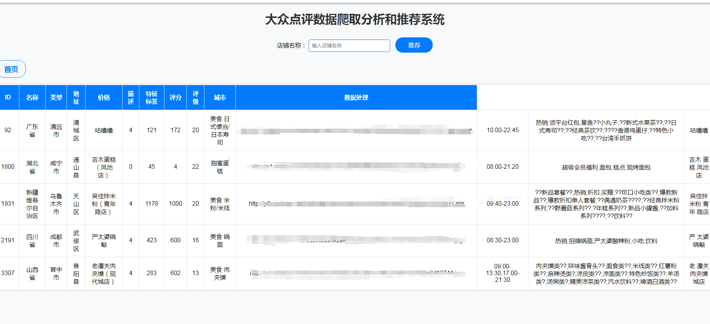
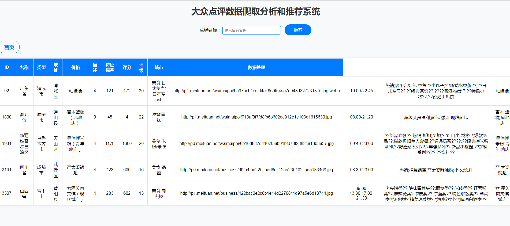
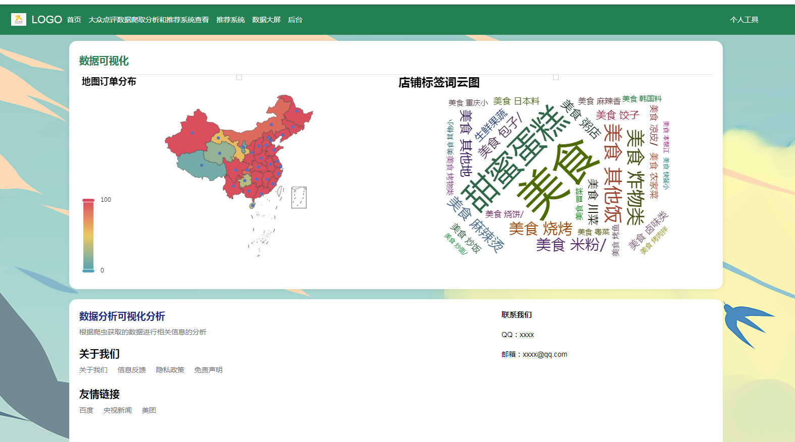
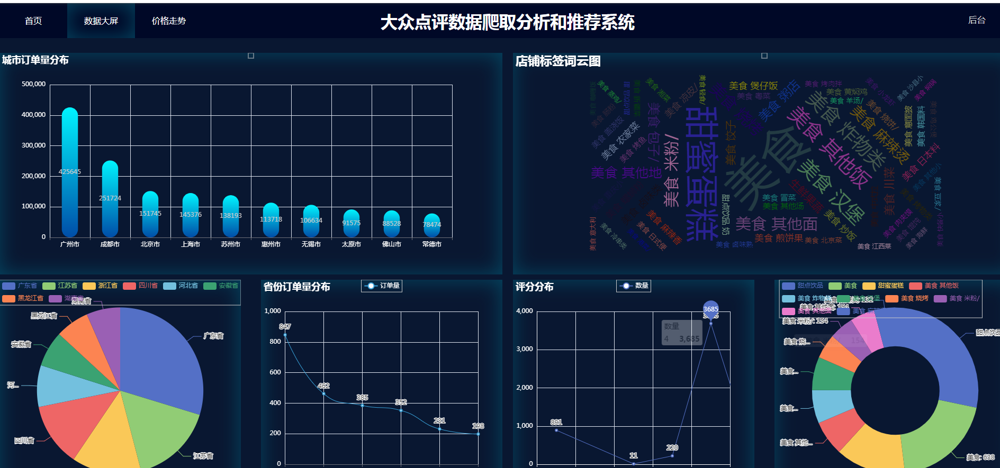
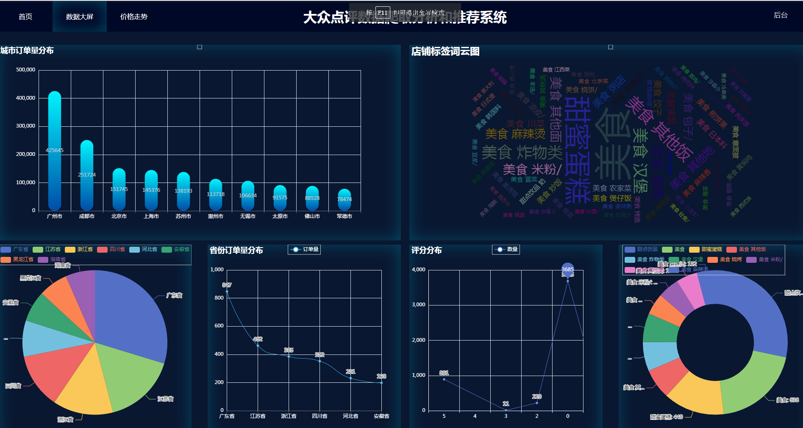
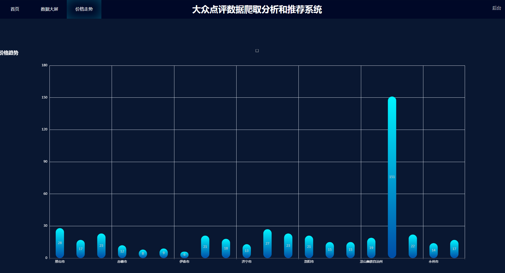
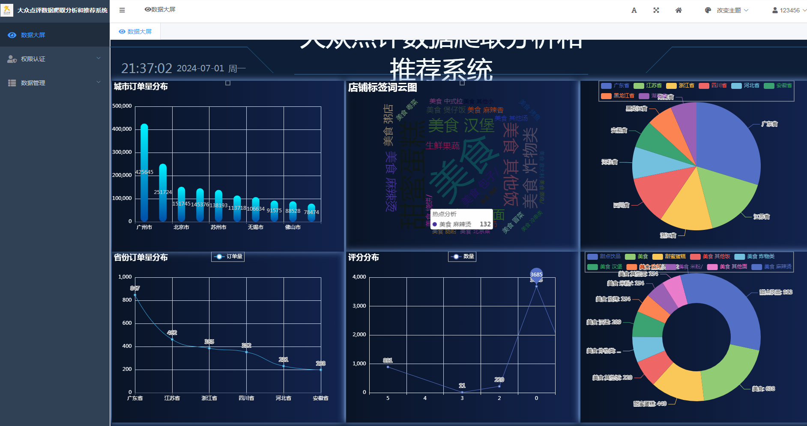
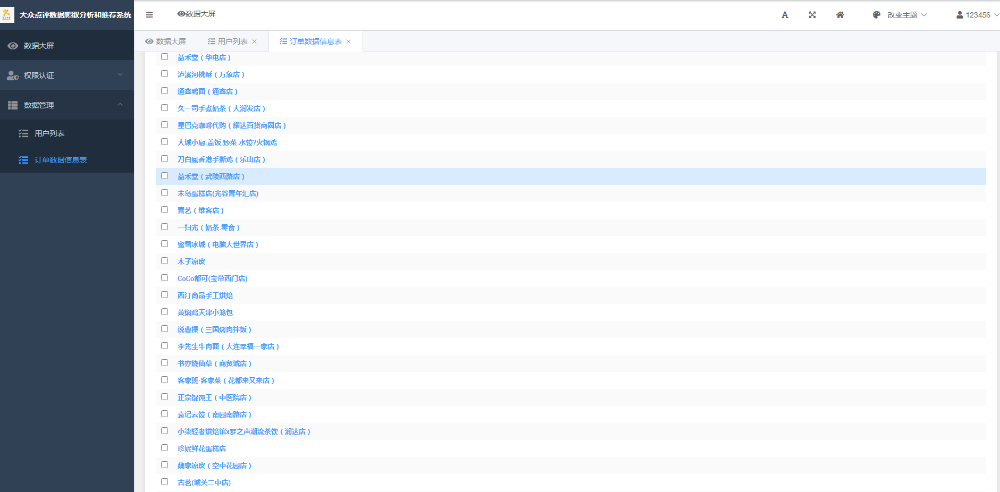
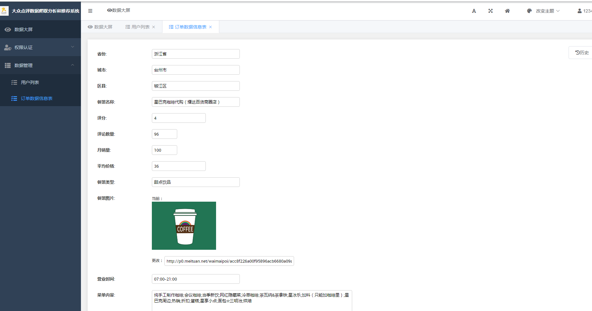

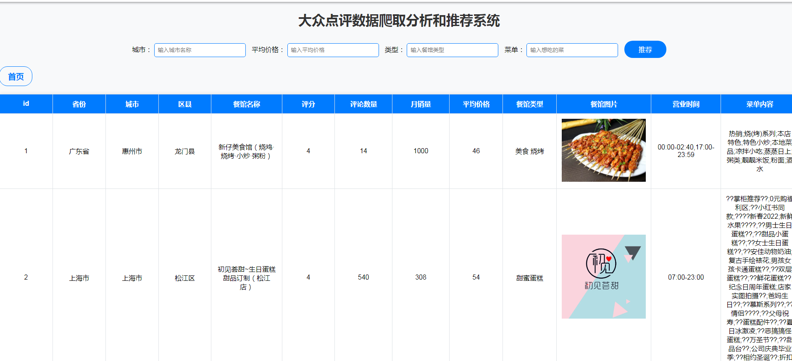
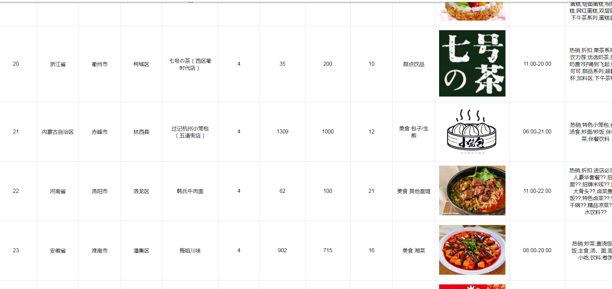

Python美食推荐系统开题报告

一、项目背景与意义

随着互联网和移动技术的飞速发展，人们的生活方式发生了巨大变化，尤其是餐饮行业。在线美食平台如雨后春笋般涌现，为用户提供了丰富的美食选择。然而，如何在海量的餐饮信息中快速找到符合个人口味和偏好的美食成为了一个新的挑战。因此，开发一个高效、个性化的美食推荐系统显得尤为重要。

本项目旨在利用Python编程语言，结合机器学习、数据挖掘等技术，构建一个能够根据用户的口味偏好、历史行为、地理位置等多维度信息，为用户提供精准美食推荐的系统。这不仅能够提升用户体验，还能帮助餐饮商家更有效地触达潜在客户，实现双赢。

二、研究内容与目标

数据收集与处理：收集包括用户基本信息、历史点餐记录、评价反馈、地理位置等在内的多源数据，并进行预处理，如数据清洗、特征提取等。
用户画像构建：基于用户行为数据，运用统计学方法和机器学习算法，构建用户画像，包括用户的口味偏好、消费习惯、活跃度等。
推荐算法设计与实现：研究并实现基于内容的推荐、协同过滤推荐、深度学习推荐等多种推荐算法，比较其在实际数据集上的表现，选择或融合最优算法。
系统设计与开发：设计并实现一个用户友好的美食推荐系统，包括前端展示界面和后端处理逻辑，确保系统的实时性、准确性和可扩展性。
性能评估与优化：通过A/B测试、离线评估等方法，对推荐系统的性能进行量化评估，并根据反馈结果不断优化算法和系统。
三、预期成果

开发出一套完整的美食推荐系统，能够为用户提供个性化、高质量的美食推荐服务。
形成一套针对美食推荐领域的数据处理、用户画像构建、推荐算法选择与优化的方法论。
提升用户体验，增加用户粘性，同时为餐饮商家带来更高的曝光率和客流量。
四、研究方法与技术路线

文献综述：调研国内外相关研究成果，分析现有美食推荐系统的优缺点。
数据分析：利用Python进行数据预处理、特征工程，探索性数据分析。
机器学习：应用Scikit-learn、TensorFlow等库实现推荐算法，并进行模型训练与调优。
系统开发：采用Flask或Django框架开发后端，HTML/CSS/JavaScript开发前端。
测试与优化：进行系统测试，收集用户反馈，迭代优化推荐算法和系统功能。
五、时间安排与进度计划

第1-2周：项目开题，文献调研，需求分析与系统设计。
第3-6周：数据收集与处理，用户画像构建。
第7-10周：推荐算法研究与实现，系统初步开发。
第11-14周：系统集成，测试与优化，用户反馈收集。
第15周：项目总结，撰写报告，准备答辩。
六、结论

本项目旨在通过Python及相关技术构建一个高效、个性化的美食推荐系统，以解决用户在海量餐饮信息中选择困难的问题，同时助力餐饮商家精准营销。预期成果将为用户带来更佳的用餐体验，也为餐饮行业数字化转型提供有力支持。

